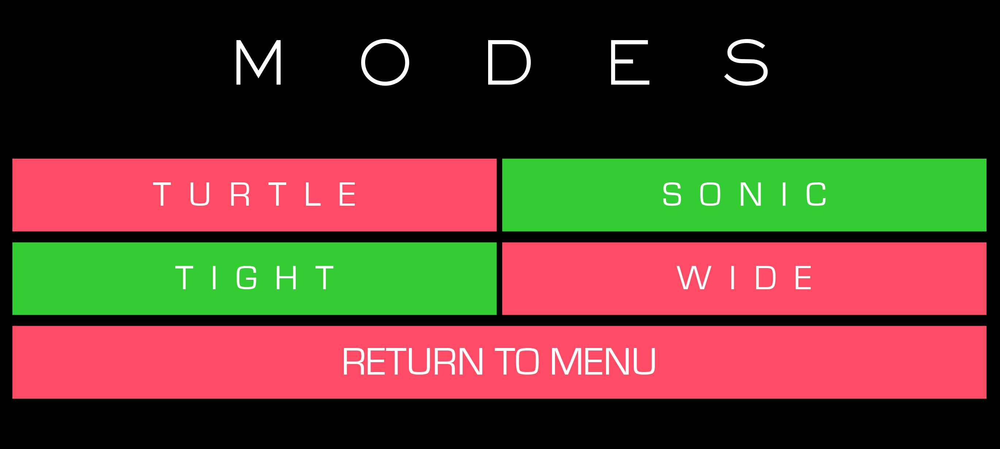

# Nebula

**Nebula** is a high-speed, minimalist perspective runner built with **Python** and **Kivy**. Designed for both desktop and mobile, it delivers a fast-paced arcade experience with intuitive controls and dynamic visuals. Pilot a tiny ship over an infinite grid, dodging gaps and chasing a climbing score as the playfield warps in pseudo‑3D.


<p align="center">
  
</p>


## 🎮 Core Gameplay
- **Procedural track generation:** New tiles spawn ahead as you move, ensuring endless replayability.
- **Dynamic speed curve:** The game ramps up difficulty as your score increases.
- **Intuitive controls:** One-touch or two-arrow controls, optimized for both desktop and mobile devices.
- **Instant restart:** Fast iteration loop for quick retries and addictive gameplay.
- **Built-in tutorial:** Helpful messages for new players, auto-hiding after a threshold.


## ✨ Features
- **Immersive perspective effects:** Lane lines and tiles warp in real-time for a pseudo-3D look.
- **Dynamic difficulty:** Gradual speed ramp up to a challenging cap.
- **Best score tracking:** Persistent high score saved locally.
- **Modes menu:** Try different gameplay variants for extra challenge and replay value.
- **Modular architecture:** Clean separation of logic for easy extension and maintenance.


## 🧩 Modes & Replay Value
<p align="center">
  
</p>

The **Modes** screen lets you experiment with different gameplay variants:
- Turtle mode (slow speed)
- Sonic mode (very fast speed)
- Tight mode (only 3 lanes)
- Wide mode (a LOT of lanes)

Each mode can be toggled for a fresh challenge, making Nebula highly replayable and easy to extend.


## 🛠 Technical Highlights
- **Cross-platform:** Runs smoothly on desktop and mobile (Android-ready via Buildozer).
- **Python + Kivy:** Rapid prototyping with a modern UI toolkit.
- **Resource management:** Assets referenced simply, with custom fonts and sound effects.
- **Perspective math:** Transform utilities for consistent, reusable effects.
- **Declarative UI:** Modular KV files for clean visual structure.


## 🗂 Project Structure
```
Nebula/
  audio/           # Sound effects & music (wav)
  fonts/           # Custom fonts
  images/          # Background art
  src/             # Game source + KV UI layouts
    main.py        # App bootstrap + root widget
    build.py       # Object creation helpers
    updates.py     # Per‑frame state updates & scoring
    transforms.py  # Perspective math utilities
    user_interactions.py # Input handlers
    menu.kv, modes.kv, nebula.kv # UI layout definitions
    best_score.txt # Simple persisted high score
  docs/media/      # Demo GIF & screenshots
  README.md
  .gitignore
```


## 🚀 Run Locally
Install dependencies and launch Nebula:
```bash
python3 -m venv .venv
source .venv/bin/activate
pip install kivy
python src/main.py
```


## 📦 Packaging (Android & Desktop)
Nebula is ready for Android and desktop packaging. Use Buildozer for mobile deployment:
```bash
pip install buildozer
buildozer -v android debug
```
Outputs appear under `.buildozer/`.


## 🏷 License
[MIT License](LICENSE)
